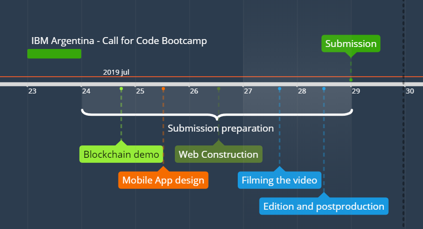

# Maturity of the Submission and the objetives
Our project is in the early stages of development. We started it in “IBM BootCamp Argentina” where we won the first prize. This situation encouraged us to continue development in the idea. Right now, we have a non-functional prototype, but given time, the project could flourish into a complete program for the general public to use.

